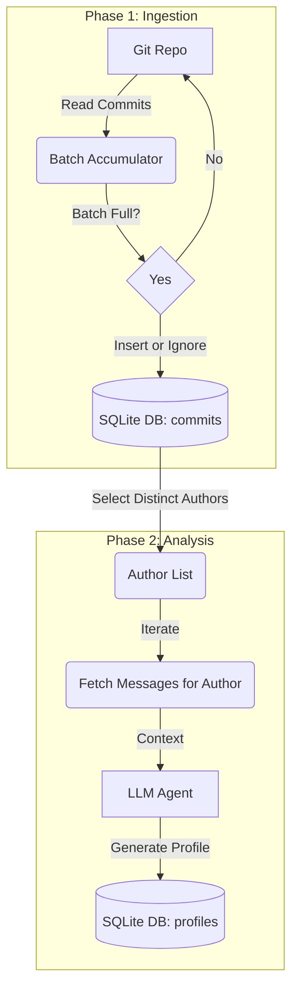

# Technical Specification: Repository Analysis Upgrade

## 1. Overview

The goal is to upgrade `analyze_repo_llm.py` to handle the entire commit history of a repository, regardless of size. To achieve this efficiently and reliably, we will implement a **Two-Phase Architecture** backed by a **SQLite** database.

## 2. Architecture

### Phase 1: Ingestion (ETL)
*   **Input**: Local git repository path (or cloned URL).
*   **Process**:
    *   Traverse *all* commits using `pydriller`.
    *   Process commits in batches (e.g., 100 commits per transaction).
    *   Store raw commit data (hash, author, message, date, diff summary) into SQLite.
    *   **Checkpointing**: The database naturally acts as a checkpoint. If the script is interrupted, we can query the DB to see which commits are already ingested (or simply upsert to avoid duplicates).
*   **Output**: Populated `commits` table in `repo_data.db`.

### Phase 2: Analysis
*   **Input**: `repo_data.db`
*   **Process**:
    *   Query unique authors from the database.
    *   For each author:
        *   Fetch all their commit messages.
        *   (Optional) filtering logic (e.g., ignore merge commits, minimum message length).
        *   Send to LLM for "Developer Profile" generation.
        *   **Capture Raw Response**: Retrieve the raw text response from the LLM before parsing.
        *   **Log/Print**: Print the raw response to the console (INFO level) for immediate visibility.
        *   **Store**: Save both the parsed JSON profile and the `raw_response` into the `author_profiles` table in SQLite.
*   **Output**: Populated `profiles` table, which can be exported to `final_analysis_results.json`.

## 3. Database Schema (SQLite)

We will use a simple schema with two main tables.

```sql
-- Table to store raw commit data
CREATE TABLE IF NOT EXISTS commits (
    hash TEXT PRIMARY KEY,
    author_name TEXT,
    author_email TEXT,
    date_timestamp INTEGER,
    message TEXT,
    files_changed TEXT -- JSON string or comma-separated list of filenames
);

-- Table to store the final LLM analysis for each author
CREATE TABLE IF NOT EXISTS author_profiles (
    email TEXT PRIMARY KEY,
    name TEXT,
    profile_json TEXT, -- The full JSON output from the LLM
    raw_response TEXT, -- The raw, unparsed response from the LLM for debugging
    last_updated INTEGER -- Timestamp of when this analysis was run
);

-- Index for faster querying by author during Phase 2
CREATE INDEX IF NOT EXISTS idx_commits_email ON commits(author_email);
```

## 4. Batch Processing Logic

### Ingestion Loop
To handle interruptions and large histories:

1.  **Initialization**: Connect to SQLite `repo_data.db`. Create tables.
2.  **Traversal**:
    *   Use `pydriller.Repository(path, order='reverse').traverse_commits()`.
    *   *Note*: `order='reverse'` typically goes Newest -> Oldest.
    *   Maintain a list `batch = []`.
3.  **Batching**:
    *   For each commit, append to `batch`.
    *   If `len(batch) >= BATCH_SIZE` (e.g., 100):
        *   `INSERT OR IGNORE INTO commits ...` for all items in `batch`.
        *   Commit transaction.
        *   Clear `batch`.
        *   Log progress: "Ingested batch... (Total: X)"
4.  **Finalization**:
    *   Insert any remaining items in `batch`.

*Resuming Strategy*: Since we use `INSERT OR IGNORE` on the Primary Key (`hash`), we can safely re-run the ingestion. It will just skip already stored commits.

### Analysis Loop
1.  **Fetch Authors**: `SELECT DISTINCT author_email, author_name FROM commits`.
2.  **Iterate**:
    *   For each author:
        *   Check if valid (exclude bots if necessary).
        *   `SELECT message FROM commits WHERE author_email = ? ORDER BY date_timestamp DESC`.
        *   Run `LLMAgent.analyze_commits(...)`.
        *   `INSERT OR REPLACE INTO author_profiles ...`.
        *   Log: "Analyzed profile for {email}".

## 5. Logging Strategy

We will replace simple `print` statements with a standard `logging` configuration to provide better visibility.

*   **Format**: `%(asctime)s - %(levelname)s - %(message)s`
*   **Levels**:
    *   `INFO`: High-level progress, **plus the raw LLM response text** for every profile generated.
    *   `DEBUG`: detailed commit info (optional, disabled by default).
    *   `ERROR`: LLM failures, DB errors.

## 6. Mermaid Workflows



## 7. Implementation Plan

1.  **Setup**: Add `sqlite3` (standard lib) and logging setup.
2.  **Class `DBManager`**: Encapsulate DB connection, schema creation (including `raw_response` column), and batch insertion methods. Implement `ALTER TABLE` check for existing databases.
3.  **Refactor `GitExtractor`**: Modify to yield batches or insert directly via `DBManager` instead of returning a huge list.
4.  **Refactor `main()`**: Split into `ingest_data()` and `analyze_profiles()`.
5.  **CLI Arguments**: Add flags like `--ingest-only`, `--analyze-only`, or default to both.

```python
# Pseudo-code for main execution flow
if __name__ == "__main__":
    setup_logging()
    db = DBManager("repo_data.db")
    
    # Phase 1
    if not skip_ingest:
        ingest_commits(repo_path, db)
        
    # Phase 2
    if not skip_analysis:
        analyze_users(db)
        
    # Export
    export_json(db, "final_analysis_results.json")